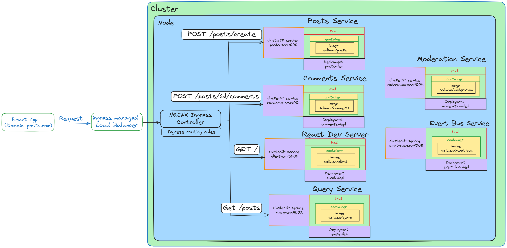

# A Mini Microservices Application

This is a minimalistic React, Node and Express application that demonstrates the basic concepts of event-based microservices.

## App Overview
In this mini microservices app, we will create 5 main functionalities:
1. Create a Post
2. List all Posts
3. Create a Comment
4. List all Comments
5. Moderate Comments

A Post can have zero or many Comments.

### Application Architecture

1. There is only one Cluster with a Node in it. The Node has six different Pods, each with only one Container in it.
2. Each Container is built with a Docker Image of the service it represents. An Image has the name of `soliman/<service_name>`. For example, the Posts Service has an Image named `soliman/posts`.
3. Each Pod has a ClusterIP Service to manage communication between services in a Cluster. A ClusterIP Service has a name of `<service_name>_srv`. For example, the Posts Service has a ClusterIP Service named `posts_srv`.
4. Each Pod has a Deployment that creates and manages the Pod. A Deployment has a name of `<service_name>_depl`. For example, the Posts Service has a Deployment named `posts_depl`.
5. The Ingress controller used in this application is the **NGINX Ingress Controller**.
6. Skaffold is used for easy deployment and update of code in Pods.

### Basic Commands

`docker build -t <image_tag> <path_to_Dockerfile>`

Builds a Docker Image.

`docker run <image_tag>`

Spins up a Docker Container.

`kubectl apply -f <config_file>`

Runs a Kubernetes yaml config file. Used to create Kubernetes Objects such as Pods, Deployments and Services.

